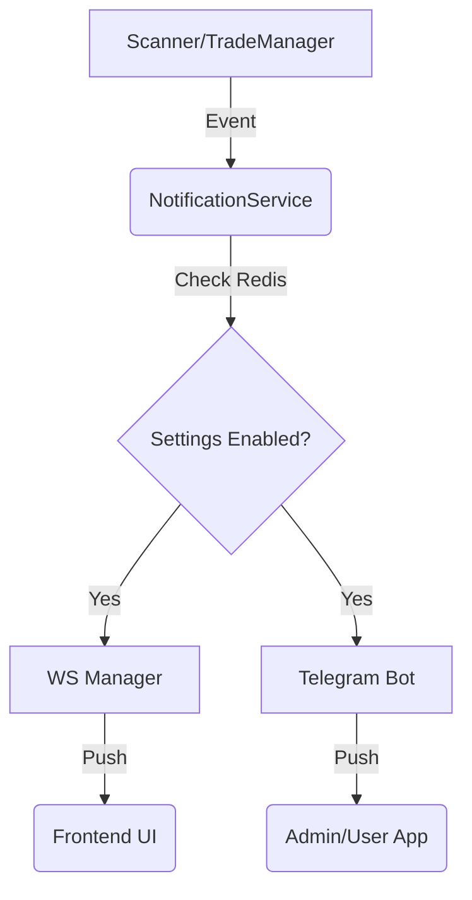

# 🎨 DESIGN: Notification Service (Phase 1)

Ngày tạo: 2026-03-18
Dựa trên: `plans/260318-2145-ws-telegram-bot/phase-01-setup.md`

---

## 1. Cách Lưu Thông Tin (Data Structure)

Dịch vụ này không lưu dữ liệu lâu dài vào Database mà chủ yếu đọc từ **Redis** để lấy cấu hình và trạng thái.

- **Redis Config (`bot:notification_settings`)**:
  - `notify_on_signal`: bool
  - `notify_on_entry`: bool
  - `notify_on_exit`: bool
  - `daily_summary_time`: string (HH:mm)

---

## 2. Thiết Kế Lớp (Class Architecture)

### `NotificationService`
Lớp trung tâm để gửi thông báo.

- **Attributes**:
  - `ws_manager`: Tham chiếu tới `ConnectionManager` (Phase 2).
  - `bot`: Instance của Telegram Bot (Phase 3).
  - `redis`: Kết nối tới Redis client.

- **Methods**:
  - `broadcast_price_update(prices)`: Đẩy trực tiếp qua WebSocket broadcast.
  - `notify_signal(signal)`: Kiểm tra cấu hình -> Gửi WS + Gửi Telegram.
  - `notify_trade_opened(trade)`: Gửi thông tin khớp lệnh.
  - `notify_trade_closed(trade, pnl_r)`: Gửi kết quả giao dịch.
  - `notify_error(module, error, critical)`: Xử lý thông báo lỗi hệ thống.
  - `send_daily_summary()`: Tổng hợp dữ liệu từ DB và gửi qua Telegram.

---

## 3. Luồng Hoạt Động (Signalling Flow)

---

## 4. Checklist Kiểm Tra (Acceptance Criteria)

### Tính năng: Notification Central Hub

✅ **Cơ bản:**
- [ ] Khởi tạo thành công với các tham chiếu WebSocket và Telegram.
- [ ] Đọc được cấu hình từ Redis và tôn trọng các flag (Enabled/Disabled).
- [ ] Không crash nếu một trong các kênh (WS hoặc Telegram) gặp lỗi.

✅ **Nâng cao:**
- [ ] `notify_error` gửi tin nhắn riêng cho Admin khi `critical=True`.
- [ ] `broadcast_price_update` không gửi qua Telegram để tránh spam.
- [ ] Tin nhắn Telegram được format đẹp (Markdown/HTML).

---

## 5. Test Cases (TDD Preparation)

### TC-01: Signal Notification Logic
- **Given**: `notify_on_signal` trong Redis là `True`.
- **When**: Gọi `notify_signal(mock_signal)`.
- **Then**: 
  - ✓ `ws_manager.broadcast` được gọi với message `signal_detected`.
  - ✓ `telegram.send_message` được gọi với nội dung tín hiệu.

### TC-02: Error Handling (Channel Isolation)
- **Given**: Kết nối Telegram bị lỗi (mất mạng/token sai).
- **When**: Gọi `notify_trade_opened(mock_trade)`.
- **Then**:
  - ✓ WebSocket vẫn nhận được thông báo thành công.
  - ✓ Hệ thống không bị crash, chỉ log lỗi Telegram.

---
Next Phase: [Phase 02: WebSocket Manager]
