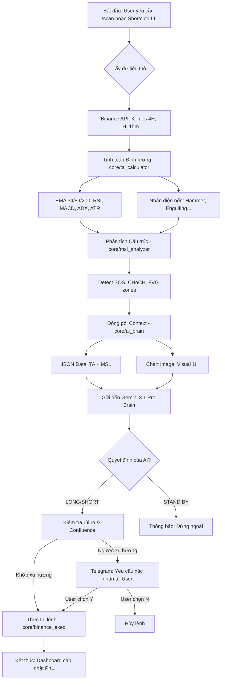

# 🧩 SƠ ĐỒ LOGIC & PSEUDOCODE
## Crypto Quant AI Bot (v0.1.6)

Tài liệu này mô tả chi tiết luồng xử lý dữ liệu và logic ra quyết định của hệ thống.

---

## 📊 1. SƠ ĐỒ LUỒNG LOGIC (FLOWCHART)



---

## 📝 2. PSEUDOCODE (MÃ GIẢ)

Dưới đây là mô phỏng logic cốt lõi của hàm `generate_trading_decision`:

```python
# MÔ PHỎNG LOGIC RA QUYẾT ĐỊNH
FUNCTION run_trading_bot(symbol):
    # 1. THU THẬP DỮ LIỆU
    raw_data = fetchData(symbol, timeframes=["4H", "1H", "15m"])
    
    # 2. XỬ LÝ SỐ LIỆU (QUANT)
    FOR tf IN timeframes:
        df = calculate_indicators(raw_data[tf])
        msl_structure = analyze_market_structure(df)
        candle_patterns = detect_candlestick_patterns(df)
    
    # 3. CHUẨN BỊ MẮT THẦN (VISUAL)
    chart_image = render_chart(df["1H"], indicators=["EMA34", "EMA89"])
    
    # 4. TRÍ TUỆ NHÂN TẠO (AI REASONING)
    ai_prompt = CreatePrompt(symbol, msl_structure, candle_patterns)
    decision = GeminiAI.infer(ai_prompt, chart_image)
    
    # 5. QUẢN TRỊ LỆNH
    IF decision.action == "LONG" OR "SHORT":
        IF decision.side != msl_structure.major_trend:
            ASK_USER_CONFIRMATION("Ngược xu hướng, bạn có muốn vào lệnh?")
        ELSE:
            execute_order(
                symbol=symbol,
                side=decision.side,
                entry=decision.price,
                tp=decision.take_profit,
                sl=decision.stop_loss
            )
    ELSE:
        LOG("AI khuyên nên đứng ngoài quan sát.")
```

---

## 🏗️ 3. TƯƠNG TÁC GIỮA CÁC MODULE

| Module | Vai trò | Công nghệ chính |
| :--- | :--- | :--- |
| **main.py** | Quản lý vòng đời (Lifespan) & API Server | FastAPI, Uvicorn |
| **data_ingestion.py** | Kết nối sàn, lấy dữ liệu nến | Async Binance Client |
| **ta_calculator.py** | "Máy tính" chỉ số kỹ thuật | Pandas-TA |
| **msl_analyzer.py** | Phân tích cấu trúc thị trường chuyên sâu | NumPy, Custom Algorithm |
| **ai_brain.py** | Điều phối suy luận AI & Vẽ Chart | google-genai, Multi-modal |
| **telegram_ctrl.py** | Giao tiếp với chủ nhân qua di động | python-telegram-bot |
| **binance_exec.py** | Thực hiện mua/bán & đặt TP/SL | Binance Algo Orders API |

---
*Tài liệu được thiết kế để hỗ trợ việc bảo trì và nâng cấp thuật toán.*
